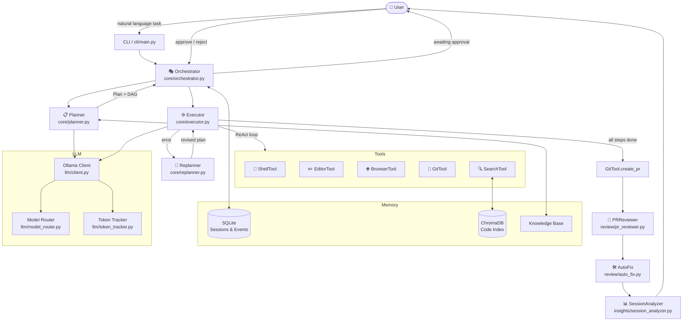

# LocalDevin

> Cognition AI の Devin AI（自律型AIソフトウェアエンジニア）のワークフローを RTX 4060 Ti 16GB のローカル環境で最大限再現するプロジェクト

## アーキテクチャ図



## Devin 機能との対応表

| Devin 機能 | LocalDevin 実装 | コマンド |
|---|---|---|
| Session / タスク実行 | `core/orchestrator.py` | `localdevin run` |
| Planning | `core/planner.py` (DAG) | 自動 |
| ReAct ループ | `core/executor.py` | 自動 |
| Dynamic Replanning | `core/replanner.py` | 自動 |
| Ask Devin | `cli/main.py ask` | `localdevin ask` |
| Devin Review | `review/pr_reviewer.py` | `localdevin review` |
| DeepWiki | `memory/codebase_index.py` | `localdevin index` |
| Session Insights | `insights/session_analyzer.py` | `localdevin insights` |
| Scheduled Sessions | `integrations/scheduler.py` | `localdevin schedule` |
| Knowledge Base | `memory/knowledge_base.py` | `localdevin knowledge` |
| ACU Tracking | `llm/token_tracker.py` | 自動 |

## モデル推奨表

| 用途 | モデル | VRAM | 備考 |
|---|---|---|---|
| メインコーディング | `qwen3.6:35b-a3b-q4_K_M` | ~14 GB | MoE 3B active |
| 高速応答 | `qwen3.5:9b` | ~6 GB | Dense |
| ビジョン | `gemma4:26b` | ~15.6 GB | MoE 4B active |

> RTX 4060 Ti 16 GB で動作確認済みの設定です。

## セットアップ手順

### 1. 前提条件

- Python 3.11+
- Docker & Docker Compose
- NVIDIA Docker Runtime（GPU利用時）
- Git

### 2. リポジトリのクローン

```bash
git clone https://github.com/halc8312/LocalDevin.git
cd LocalDevin
```

### 3. 環境変数の設定

```bash
cp .env.example .env
# エディタで .env を編集（最低限 LD_GITHUB_TOKEN を設定）
```

### 4. セットアップ

```bash
make setup
```

このコマンドは以下を実行します:
1. Python パッケージのインストール
2. Docker コンテナの起動（Ollama + ChromaDB）
3. LLM モデルのダウンロード

### 5. 動作確認

```bash
localdevin status
```

## 使用例

### タスクを実行する

```bash
# リポジトリに Stripe 決済機能を追加する
localdevin run "Add Stripe payment integration" --repo ./my-project

# Playbook を指定して実行
localdevin run "Fix failing tests" --repo ./my-project --playbook test-coverage
```

### コードベースに質問する

```bash
localdevin ask "認証はどこで処理されていますか?" --repo ./my-project
```

### PR をレビューする

```bash
localdevin review --repo ./my-project --branch feature/add-stripe
```

### コードベースをインデックスする

```bash
localdevin index --repo ./my-project
```

### 定期実行を設定する

```bash
# 毎朝9時にテストカバレッジ向上タスクを実行
localdevin schedule coverage "0 9 * * *" "Improve test coverage" --repo ./my-project
```

### セッションを分析する

```bash
localdevin insights <session-id>
```

## ライセンス

MIT